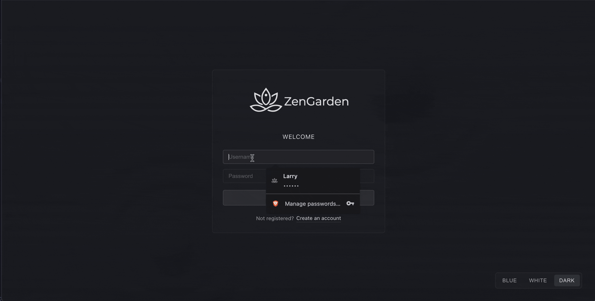

Zen Garden is a **local-first, cross-platform meditation app** built with **Electron** (desktop), **Capacitor** (mobile), **Vue 3**, and TypeScript. Your journal lives in a **vault** — a folder you choose, holding plain JSON files. No server, no cloud, no account. Features a meditation timer with bell sounds, breathing exercises, a meditation calendar, and relaxing Zen animations.

> **Prebuilt binaries are published for Linux only.** The source is MIT licensed and runs on macOS
> and Android too — see [Other platforms](#other-platforms) to build either one yourself.

## Demo



## Features

### Meditation & Mindfulness

- **Meditation timer** - configurable duration with bell interval markers
- **Bell sounds only** - no artificial ambient sounds or music; in Zen tradition, the world is your soundtrack
- **Meditation calendar** - visual tracking of your meditation history
- **Session notes** - reflect and journal after each session

### Breathing & Wellness

- **Breathing exercises** - Box, 4-7-8, Deep, and Energizing techniques
- **Emotion tracker** - log and monitor your daily emotional state with daily notes

### Insights & Progress

- **Correlation insights** - discover the impact of meditation on your emotions
- **Eightfold Path tracker** - follow Buddhist principles for mindful living
- **Statistics dashboard** - meditation days, average time, and emotional trends
- **Duration impact analysis** - see how meditation length affects your wellbeing

### Design & Experience

- **Vault-based storage** - point the app at any folder; your journal is plain JSON files inside it
- **Zen philosophy built-in** - explains the design choices behind the app
- **Animated Zen backgrounds** - Wind, Waves, and other animations
- **Fully responsive** - optimized for different screen sizes
- **8 languages** - English, Spanish, Italian, French, German, Portuguese, Chinese, Japanese

### Technical Features

- **Cross-Platform** - Linux desktop releases; macOS and Android build from source
- **100% Offline** - works completely without internet connection
- **User-Accessible Storage** - plain JSON files in a folder you picked; view, back up and sync them however you like
- **No accounts** - no sign-up, no password, no recovery codes; the folder is the whole story
- **Privacy-first** - no server, no tracking, no data collection, no telemetry
- **Secure** - sandboxed renderer, typed IPC bridge, Zod-validated arguments, atomic file writes

> **Privacy Note:** This app runs entirely on your device. Your meditation data, emotions, and notes are stored in JSON files inside your vault folder and never leave your device.

## Security & Privacy

Zen Garden is built with privacy and security as core principles:

### Privacy Guarantees

- ✅ **No telemetry** - We don't collect any usage data, analytics, or crash reports
- ✅ **No network requests** - The app works 100% offline and makes zero external connections
- ✅ **No cloud sync** - Your data never leaves your device unless you explicitly copy it
- ✅ **No accounts at all** - No sign-up, no login, no password. The app opens a folder; that is the entire model

### Security Architecture

- ✅ **Electron hardening** - Renderer runs sandboxed with context isolation and Node.js integration disabled
- ✅ **Typed preload bridge** - Narrow IPC API; no raw Node or Electron APIs leak to the frontend
- ✅ **Nothing secret to leak** - No credential is stored, because none exists. Protecting the vault is the operating system's job, and yours
- ✅ **Owner-only files** - Files the app creates are written `0600`; the folder you chose is left with the permissions you gave it
- ✅ **Atomic writes** - Data written to `.tmp` then renamed, preventing corruption on crash
- ✅ **Input validation** - Every IPC argument is parsed with a Zod schema in the main process before use
- ✅ **Content Security Policy** - `default-src 'self'`, no `unsafe-eval`; `object-src`/`frame-src`/`base-uri`/`form-action` all denied
- ✅ **Navigation containment** - External links open in the system browser; in-app navigation away from the app origin is blocked
- ✅ **Deny-all permissions** - Camera, microphone, geolocation and every other web permission are refused at the session level
- ✅ **Open source** - Full transparency — audit the code yourself

### Reporting Security Issues

If you discover a security vulnerability, please see [SECURITY.md](.github/SECURITY.md) for reporting instructions.

## Data Storage

Your data lives in a **vault**: a folder holding plain JSON files, and nothing else. The app has no database, no hidden application-support directory, and no record of you outside that folder.

### Desktop

You choose the folder on first launch, and can change it any time from Settings. Put it wherever suits you — a synced directory, an external drive, a git repository. Common choices:

- **Linux:** `~/Documents/ZenGarden/`, `~/journal/`
- **macOS:** `~/Documents/ZenGarden/`, `~/Desktop/ZenGarden/`

The only thing kept outside the vault is which folder to reopen, in `state.json` under the app's config directory. Delete it and the app simply asks again.

### Mobile

- **Android:** `Documents/ZenGarden/`

Android has no folder picker that yields a real path, so the vault is fixed there. It sits in public Documents on purpose: the files hold nothing but the journal, so a location you can open in a file manager and copy to a desktop vault is exactly what you want.

### Files

- `meditations.json` - Meditation sessions
- `emotion_logs.json` - Emotion tracking data
- `eightfold_path_logs.json` - Buddhist path progress
- `settings.json` - Theme and language, so they travel with the vault

> **Note:** These are ordinary files. Copy the folder to another machine and the app opens it as-is;
> back it up, sync it, or read it with anything that understands JSON.

## Getting Started

### Prerequisites

- Node.js 24+ (enforced by `engines` in [package.json](package.json))
- npm
- **For Android development:** [Android Studio](https://developer.android.com/studio) installed (provides the JDK and Android SDK)

### Setup

1. **Clone the repository**

```sh
git clone https://github.com/larrydarko1/ZenGarden.git
cd ZenGarden
```

2. **Install dependencies**

```sh
npm install
```

3. **No additional configuration needed!** This desktop app has no backend server or cloud database. Everything runs locally.

### Development

#### Desktop Development

```sh
# Start the Electron app in development mode
npm run dev
```

This will:

- Start Vite dev server on http://localhost:3000
- Launch the Electron desktop app
- Enable hot reload for development

#### Mobile Development

Requires **Android Studio** to be installed at the default location. The npm scripts automatically set `JAVA_HOME` and `ANDROID_HOME` to use Android Studio's bundled JDK and SDK, so no manual environment variable configuration is needed.

| Variable       | Path (set automatically by the scripts)                       |
| -------------- | ------------------------------------------------------------- |
| `JAVA_HOME`    | `/Applications/Android Studio.app/Contents/jbr/Contents/Home` |
| `ANDROID_HOME` | `~/Library/Android/sdk`                                       |

> **Note:** If Android Studio is installed in a non-default location, or you're on Linux, update the paths in the `cap:run:android` script in [package.json](package.json).

**Quick Start:**

```sh
# Build and sync to mobile platforms
npm run build:mobile

# Open in native IDEs
npm run cap:open:android  # Requires Android Studio

# Build, sync, and run on device/emulator (JAVA_HOME & ANDROID_HOME are set inline)
npm run cap:run:android
```

### Testing & Code Quality

```sh
# Run all unit tests
npm test

# Run tests in watch mode
npm run test:watch

# Lint source code
npm run lint

# Auto-fix lint issues
npm run lint:fix

# Check formatting
npm run format:check

# Auto-format source code
npm run format
```

Tests live in the `tests/` directory and mirror the `src/` structure.

Beyond the standard lint/format/test steps, the repo enforces its own conventions through a set of
check scripts under [scripts/check/](scripts/check/). `npm run ci:check` runs the whole gate locally —
the same list, in the same order, that [CI](.github/workflows/ci.yml) runs on every push and pull request:

| Script            | Enforces                                                                        |
| ----------------- | ------------------------------------------------------------------------------- |
| `audit:check`     | No high-severity vulnerabilities in production dependencies                     |
| `pkg:check`       | `package.json` field order, metadata, and script conventions                    |
| `pipeline:check`  | The CI workflow and `ci:check` do not drift apart                               |
| `code:check`      | General code-style rules not covered by ESLint                                  |
| `declorder:check` | Declaration order within modules                                                |
| `html:check`      | Template/HTML standards                                                         |
| `scss:check`      | SCSS structure, token usage, and nesting depth                                  |
| `refactor:check`  | Module size and complexity ceilings                                             |
| `ipc:check`       | Every IPC channel is declared, typed, and validated on both ends                |
| `security:check`  | Electron process model, navigation containment, permission handlers, HTML sinks |
| `error:check`     | Error-handling conventions                                                      |
| `dup:check`       | Copy-paste duplication ([jscpd](https://github.com/kucherenko/jscpd))           |
| `dead:check`      | Unused files, exports, and dependencies ([knip](https://knip.dev))              |
| `i18n:check`      | Every user-facing string is translated across all 8 locales                     |
| `test:check`      | Test-suite structure and coverage conventions                                   |

### Building Desktop Apps

```sh
# Build for your current platform
npm run build:electron

# Build for Linux — the platform this project releases
npm run build:linux

# Build for macOS — unreleased, self-build only (see Other platforms)
npm run build:mac
```

The built installers will be in the `dist-electron/` directory:

- **Linux:** `.AppImage`, `.deb`, `.rpm` and `.tar.gz` packages
- **macOS:** `.dmg` installer (Apple Silicon / arm64)

Building the `.rpm` needs the `rpm` tool on the build machine (`sudo apt-get install rpm` on
Debian/Ubuntu); the other Linux targets have no extra prerequisite. `build:mac` has to run on a Mac.

## Other platforms

Releases carry Linux packages only. macOS and Android are both absent for the same reason: a download that installs cleanly needs a signing certificate this project does not have, and an unsigned one asks the person downloading it to disable a security warning first.

- **macOS** needs a paid Apple developer certificate. An ad-hoc signature is rejected by Gatekeeper often enough — the "app is damaged" dialog — that the download caused more problems than it solved.
- **Android** needs a signing key, and a build signed with a throwaway key installs only after the user allows "install from unknown sources". Handing out an APK on those terms teaches a habit worth not teaching.

Both build targets are still in the repository and are deliberately kept working. ZenGarden is MIT licensed, so if you want it on either platform, build it — the vault format is identical, so a folder you build for yourself opens the same journal as a released Linux build.

**macOS:**

```sh
git clone https://github.com/larrydarko1/ZenGarden.git
cd ZenGarden && npm ci && npm run build:mac
```

The `.dmg` lands in `dist-electron/`, ad-hoc signed for the machine that built it.

**Android** — needs Android Studio for the JDK and SDK, as under [Mobile Development](#mobile-development):

```sh
git clone https://github.com/larrydarko1/ZenGarden.git
cd ZenGarden && npm ci && npm run build:mobile
cd android && ./gradlew assembleDebug
```

The APK lands in `android/app/build/outputs/apk/debug/`. Installing it means allowing your device to
install from an unknown source, which is the cost of an unsigned build. If you would rather sign it
with your own key, generate a keystore, wire it into `android/app/build.gradle`, and run
`./gradlew assembleRelease`.

Nothing about the app is crippled on either platform — the platform-specific paths are all still
there.

What "unsupported" means in practice: the maintainer does not run macOS anymore and cannot reproduce
or verify anything there; Android is developed against but has no distribution channel. Bug reports
from self-built platforms are welcome and will be read, but they are fixed on a best-effort basis,
and CI never builds or tests them. The same applies to Windows, which has no build target at all —
`electron-builder --win` may well work, but nobody has checked.

### Installing the App

After building:

1. Navigate to `dist-electron/`
2. Double-click the installer for your platform
3. Follow installation prompts
4. Launch "ZenGarden" from your applications menu

## Distribution

To share the app with others:

1. Build for the target platform(s)
2. Share the installer file from `dist-electron/`
3. Users install like any native app
4. No server setup required - each installation is completely independent

## Tech Stack

- **Desktop:** Electron 44, electron-vite 5 (Linux releases; macOS builds from source)
- **Mobile:** Capacitor 8 (native Android app, builds from source)
- **Frontend:** Vue 3, TypeScript (strict), Vite, SCSS, vue-i18n
- **Storage:** Vault folder of plain JSON files, written atomically
- **Security:** Sandboxed renderer + context-isolated preload bridge, Zod-validated IPC arguments
- **Testing:** [Vitest](https://vitest.dev) + jsdom (467 tests across 36 test files, 80% coverage enforced)
- **Code Quality:** [ESLint](https://eslint.org) flat config (modular, under [eslint/](eslint/)), [Prettier](https://prettier.io), [Stylelint](https://stylelint.io), husky + lint-staged + commitlint
- **Build Tools:** [electron-vite](https://electron-vite.org) + Electron Builder + Capacitor CLI
- **CI:** GitHub Actions — 16 convention checks → type-check → build → tests at 80% coverage

## Project Structure

```
src/
├── main/                        → Electron main process (Node.js)
│   ├── index.ts                 → BrowserWindow setup, IPC registration, app lifecycle
│   ├── lib/
│   │   ├── config.ts            → The only module that reads process.env, Zod-validated
│   │   ├── jsonFile.ts          → Atomic, owner-only JSON reads and writes
│   │   └── logger.ts            → Main-process logging (electron-log)
│   └── services/
│       ├── vault.ts             → Vault root, folder picker, vault settings
│       ├── data.ts              → Data handlers (meditations, emotions, eightfold path)
│       ├── analytics.ts         → Emotion + eightfold path analytics computation
│       └── db.ts                → Collection reads and writes inside the open vault
├── preload/
│   └── index.ts                 → contextBridge — narrow typed API exposed to renderer
├── schemas/                     → Shared across main, preload and renderer
│   ├── storage.ts               → Wire types + the Zod schemas IPC arguments are validated against
│   └── electron.d.ts            → The contextBridge contract, declared once for both ends
└── renderer/                    → Vue 3 SPA
    ├── components/              → Decomposed UI components
    │   ├── Home.vue             → Main dashboard orchestrator
    │   ├── home/                → MeditationOverlay, BottomNav
    │   ├── emotions/            → EmotionAnalytics, EightfoldPathView, DailyNotes
    │   ├── animations/          → Zen background SVG animations
    │   └── common/              → Shared primitives (ZenSpinner)
    ├── composables/             → Reactive state + side-effect management
    │   ├── useMeditationSession.ts
    │   ├── useEmotions.ts
    │   └── useEightfoldPath.ts
    ├── store/                   → Storage adapter layer
    │   ├── types.ts             → IStorageAdapter + re-export of the shared wire types
    │   ├── index.ts             → Thin wrappers delegating to active adapter
    │   └── adapters/
    │       ├── factory.ts       → Auto-detects Electron or Capacitor, caches adapter
    │       ├── electron.ts      → IPC bridge to main process
    │       ├── capacitor.ts     → Capacitor Filesystem + Web Crypto
    │       └── capacitor/
    │           ├── db.ts        → Mobile JSON file I/O
    │           └── crypto.ts    → PBKDF2 via Web Crypto API
    ├── styles/                  → SCSS design system (variables, mixins, themes, components)
    ├── utils/
    │   ├── platform.ts          → Runtime platform detection
    │   └── logger.ts            → Renderer-side logging
    └── locales/                 → 8 language bundles (en, es, it, fr, de, pt, zh, ja)
eslint/                          → Modular ESLint flat-config fragments
scripts/check/                   → Repo convention checks run by `npm run ci:check`
tests/                           → Mirrors src/ — 36 test files, 467 tests
```

## Architecture

### Desktop (Electron)

```
Desktop App
├── Electron (Native shell)
│   ├── Main Process (Node.js)
│   │   ├── services/vault.ts      → Vault root, folder picker, vault settings
│   │   ├── services/data.ts       → Meditation, emotion, eightfold path CRUD
│   │   ├── services/analytics.ts  → Analytics computation
│   │   └── services/db.ts         → JSON persistence with atomic writes
│   ├── Preload (contextBridge, CommonJS — required by the sandbox)
│   │   └── Typed IPC API — no Node.js exposure to renderer
│   └── Renderer Process (Chromium, sandboxed)
│       └── Vue 3 App → store/adapters/electron.ts → IPC calls
└── Data Storage
    └── JSON files in the vault folder you chose
```

### Mobile (Capacitor)

```
Mobile App
├── Capacitor (Native shell)
│   ├── Native Android Runtime
│   ├── WebView (renders Vue app)
│   │   └── Vue 3 App → store/adapters/capacitor.ts → Filesystem API
│   └── Native Plugins
│       ├── Filesystem API (JSON file operations)
│       └── Preferences API (platform probe)
└── Data Storage
    └── Android: Documents/ZenGarden/data/
```

### Storage Adapter Pattern

The app uses an `IStorageAdapter` interface implemented by two adapters. `getAdapter()` in
[factory.ts](src/renderer/store/adapters/factory.ts) probes the platform at runtime and caches the result:

- **ElectronStorageAdapter** — bridges Vue to the Node.js JSON backend via IPC
- **CapacitorStorageAdapter** — uses the Capacitor Filesystem API against the fixed Android vault
- **Same interface, same files** — a vault written by one opens in the other

Every argument crossing the Electron IPC boundary is re-validated in the main process against a Zod
schema in [schemas/storage.ts](src/schemas/storage.ts). Handlers answer with a discriminated
`IpcResult` — success or error as data — rather than throwing across the bridge; the renderer's
adapter is where a failure becomes a thrown error again.

## Data Format

Each file is a JSON array of plain documents. Example meditation record:

```json
{
    "_id": "lqr8g4k3j2h",
    "date": "2026-01-22",
    "duration": 20,
    "notes": "Great session focusing on breath"
}
```

No owner field, no envelope, no wrapper types — the vault folder is the scope. This makes it easy to:

- Read your journal in any text editor
- Back it up by copying a folder
- Process it with scripts, or diff it in git

## Backup & Migration

### Backing Up Your Data

Copy the vault folder. That is the backup — there is nothing else to collect.

**Desktop:** wherever you pointed the app. Because you chose the folder, putting it in a synced
directory or a git repository makes backup something you no longer think about.

**Android:** `Documents/ZenGarden/`, reachable from any file manager.

### Restoring Data

1. Quit the app
2. Put the folder back, or copy it somewhere new
3. Restart the app and point it at the folder

Desktop and Android write the same files, so a vault copied between them opens either way.

## Contributing

Zen Garden is a personal portfolio project and is **not open to outside contributions** — see
[CONTRIBUTING.md](.github/CONTRIBUTING.md). Bug reports are welcome, and the code is MIT licensed,
so forking it is explicitly fine.

Found a security vulnerability? Do not open a public issue — email <hello@larrydarko.dev>. See
[SECURITY.md](.github/SECURITY.md).

## License

This project is licensed under the MIT License. See [LICENSE](LICENSE) for details.
